# Guía de Instalación y Ejecución de Jupyter Notebook

## 1. Verificación de Python
Primero, debemos comprobar si contamos con Python instalado ejecutando el siguiente comando en la terminal:

```bash
python --version
```

## 2. Instalación de Jupyter
Una vez comprobado que Python está instalado, procedemos a instalar el entorno con:

```bash
pip install notebook
```

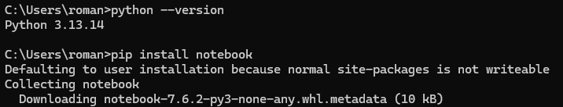

> **Nota sobre el límite de rutas en Windows:** Al intentar realizar instalaciones en rutas muy anidadas de la Tienda de Windows (`AppData\Local\Packages\...`), es común superar el límite clásico de Windows de 260 caracteres (*Windows Long Path support*). 
> 
> Para evitar este problema, utilizamos la alternativa más simple:
```bash
pip install notebook --no-warn-script-location
```

## 3. Ejecución
Para iniciar la aplicación y evitar errores de ruta, ejecútala directamente desde el módulo de Python:

```bash
python -m notebook
```

Una vez ejecutado, se abrirá automáticamente una pestaña en el navegador web con la interfaz de Jupyter. De no ser así, deberemos utilizar una de las dos rutas (URLs) que encontraremos en la terminal.

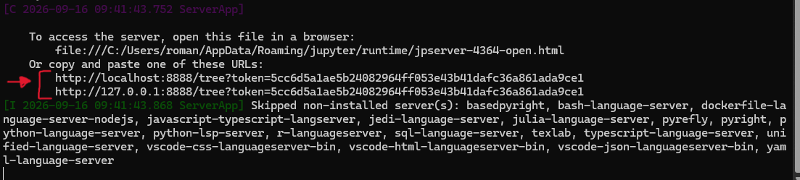

# Instalación del Kernel de Almond (Scala para Jupyter)

## 1. Verificación de Java
Lo primero que debemos hacer es comprobar si contamos con Java instalado ejecutando el siguiente comando en la terminal:

```bash
java --version
```
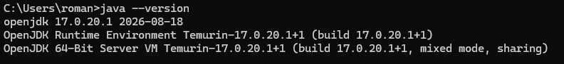

## 2. Descarga del CLI de Coursier
Una vez comprobado Java, descargamos Coursier mediante su script de instalación automática:

```bash
curl -Lo coursier https://git.io/coursier-cli
```

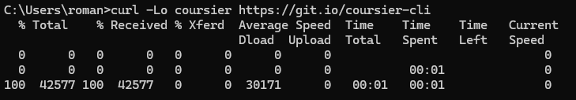

## 3. Configuración del Kernel en Jupyter
Para configurar el kernel de Scala en Jupyter, necesitamos el instalador de Coursier. 

1. Descarga el archivo ZIP desde la página oficial de lanzamientos:
   [Enlace de descarga de Coursier (Windows x86_64)](https://github.com/coursier/coursier/releases/download/v2.1.24/cs-x86_64-pc-win32.zip)
2. Extrae el contenido del archivo ZIP.
3. Ejecuta el archivo ejecutable que se encuentra dentro de la carpeta y sigue los pasos indicados en la terminal.

## 4. Instalación de Almond
Una vez completado el paso anterior, ejecutamos el siguiente comando para instalar el kernel de Almond:

```bash
cs launch almond --scala 2.12 -- --install
```

## 5. Verificación y Ejecución
Para comprobar que todo funciona correctamente, iniciamos JupyterLab ejecutando:

```bash
python -m jupyterlab
```

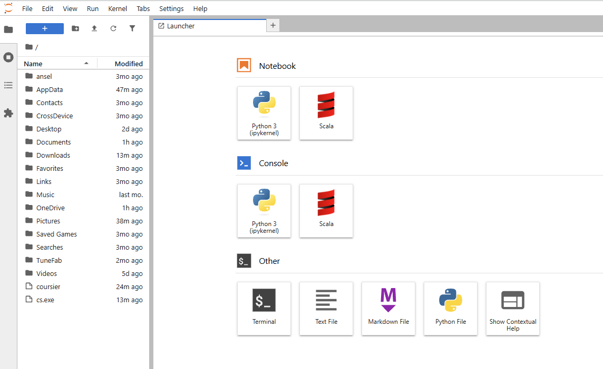

Esto abrirá automáticamente una pestaña en el navegador web con la interfaz de JupyterLab. De no ser así, copia y pega en tu navegador una de las rutas (URLs) que se muestran en la terminal.

## 6. Pruebas Iniciales

Por ultimo, para comprobar que el kernel de Scala (Almond) responde correctamente en JupyterLab, realizaremos unas pequeñas pruebas de código:

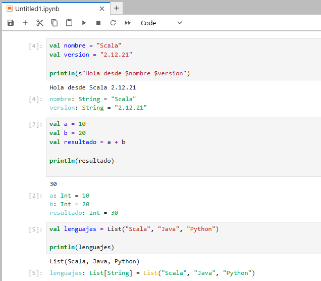


# Guía de Instalación y Configuración de Scala con VS Code

1. **Verificar la versión de Java**
   Lo primero que haremos es verificar el estado de la versión de Java con los comandos:
   ```bash
   java -version
   ```
   


   ```bash
   javac -version
   ```

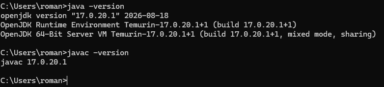

1. **Instalar Visual Studio Code**
   Ahora instalaremos VS Code desde [su web oficial](https://code.visualstudio.com/). Le daremos a **Download for Windows**. Una vez instalado, ejecutamos el programa.


3. **Instalar Metals**
   En la parte lateral izquierda, en el apartado de extensiones, deberemos buscar la extensión **Scala (Metals)** e instalarla.

   

5. **Instalar y comprobar sbt**
   Por último, instalaremos `sbt`. Para ello usaremos el CMD en modo administrador con el comando:
   ```bash
   choco install sbt -y
   ```

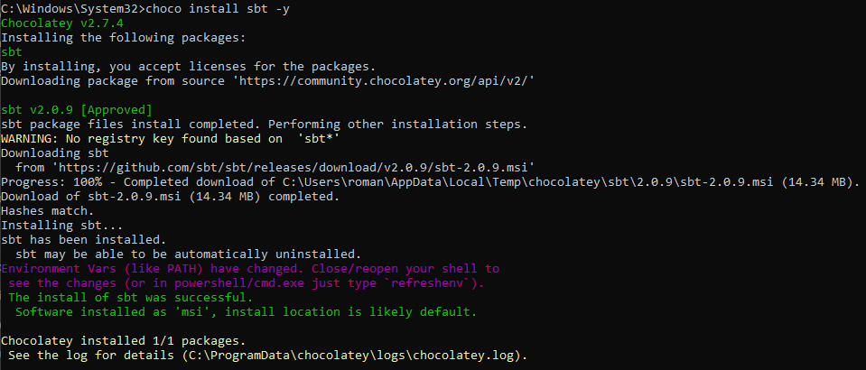  

   Finalmente, comprobaremos si hemos instalado `sbt` correctamente con el comando:
   ```bash
   sbt --version
   ```

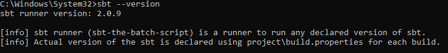  

5. **Crear un proyecto Scala**
   Para finalizar, vamos a crear un pequeño proyecto con Scala con el comando:
   ```bash
   sbt new scala/scala-seed.g8
   ```
   Después nos pedirá el nombre del proyecto y usaremos `scala-vscode` como ejemplo.

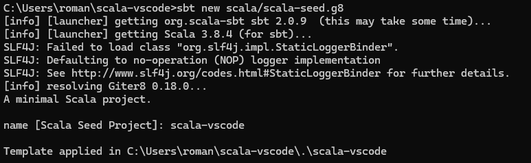  

   Aqui mostramos la configuracion del archivo `build.sbt`

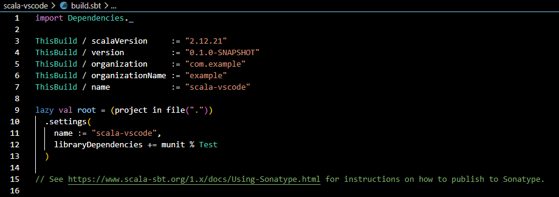    

7. **Compilar y ejecutar el programa**
   Para ejecutar el programa haremos un `sbt compile`

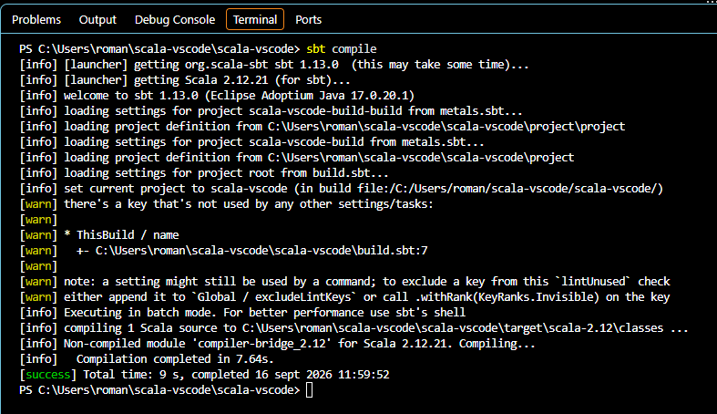  

   Por último un `sbt run`.

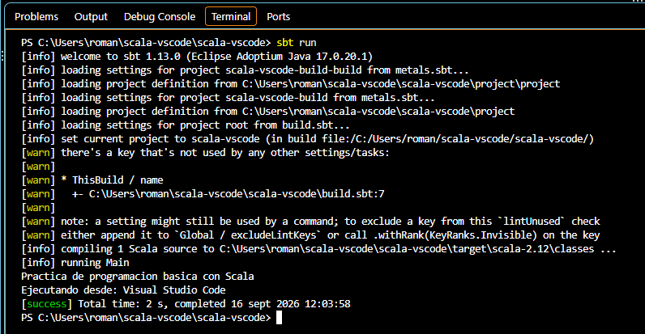  

# Guía de Instalación IntelliJ + scala 2.12.21 + sbt

## 1. Descarga de IntelliJ IDEA
Puedes descargar la versión oficial de IntelliJ IDEA desde la web oficial de JetBrains a través del siguiente enlace:
[Descargar IntelliJ IDEA](https://www.jetbrains.com/idea/?source=google&medium=cpc&campaign=EMEA_en_REST_IDEA_Google_Branded&term=intellij&content=693349187757&gad_source=1&gad_campaignid=9736965301&gbraid=0AAAAADloJzhdjZgur5qacmvgbRx82xveN&gclid=CjwKCAjw_KjVBhAHEiwAnC0N9O2RbaqU28gmEvSzM4ZJmx5c2GkyI5WJsuqvdsjhI9mX-UfedNKhaxoCZ34QAvD_BwE)

  

## 2. Instalación del Plugin de Scala
Una vez instalado y abierto IntelliJ IDEA, dirígete al apartado de **Plugins** y busca e instala el plugin oficial de **Scala**.

 

## 3. Creación y Prueba de un Pequeño Programa
Para verificar que todo funciona correctamente, crearemos un programa básico en un proyecto configurado con SBT. 

Estructura archivo `build.sbt`

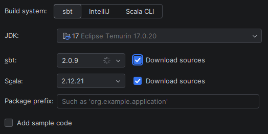 

Puedes compilar el proyecto ejecutando el siguiente comando en la terminal:
```bash
sbt compile
```

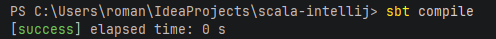 

Y para ejecutar la aplicación, utiliza:
```bash
sbt run
```

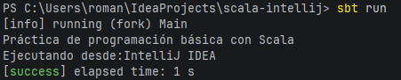 

## 4. Estructura del Proyecto
A continuación se muestra la estructura típica de directorios y archivos para un proyecto de Scala con SBT:

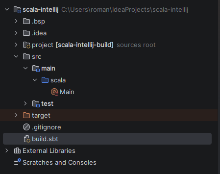 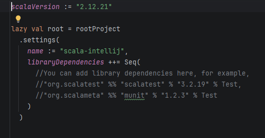
